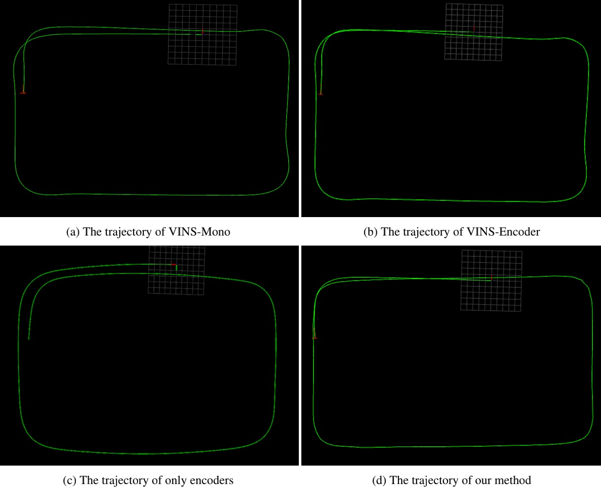
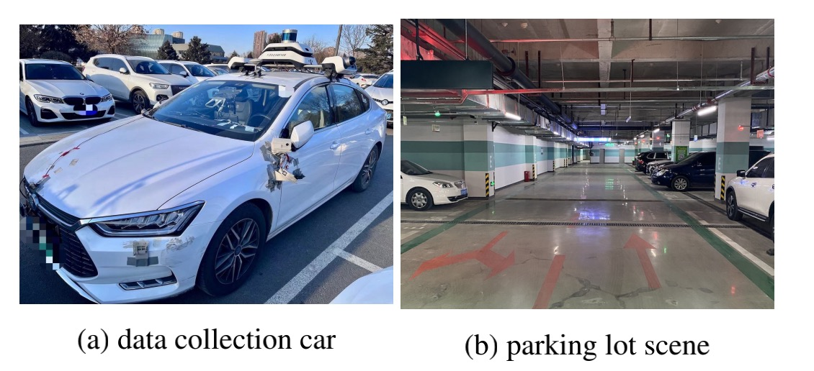

# WAG-VIO
## Visual Odometry Tightly Coupled with Wheel Encoder and Gyroscope
#### we replace the accelerometer with a wheel encoder and present a method of using a low-cost camera and a gyroscope to estimate the robot's motion state. Compared with the traditional VIO system, the derivation of the motion state estimation proposed in this paper is more concise. Our algorithm based on the VINS-Mono has better real-time performance and is more suitable for embedded devices.

  

  

<!-- 

	
	
	
	

 -->

## Contributors

Jun Liu (Email: [1193868236@qq.com](1193868236@qq.com))

## Credits

We hereby recommend reading [VINS-Mono](https://github.com/HKUST-Aerial-Robotics/VINS-Mono.git) for reference and thank them for making their work public.

## License

The source code is released under [GPLv3](http://www.gnu.org/licenses/) license.

I am constantly working on improving this code. For any technical issues or commercial use, please contact me(1193868236@qq.com).
